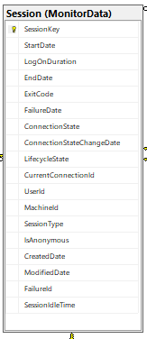
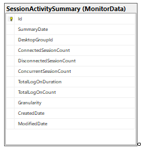
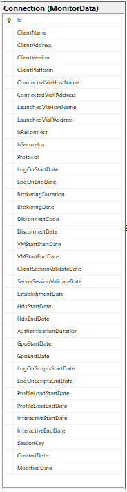
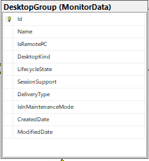
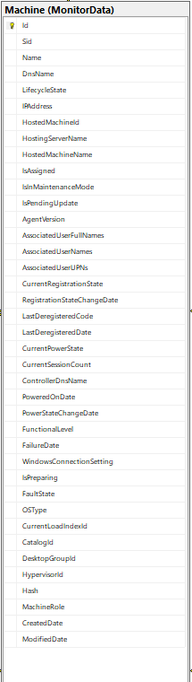
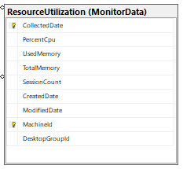
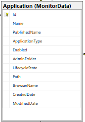
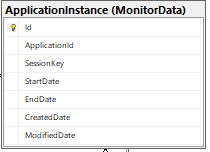
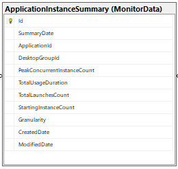

# Introduction 

Citrix Director is the go to tool for troubleshooting and monitoring the CVAD environment. It helps in monitoring and triaging live sessions through Activity Manager, User Details, Client Details and Machine details pages. Director also provides reporting functionality through trends pages which covers the historical reports on the number of sessions, concurrent sessions, failures, logon duration trends, probes etc.

While Citrix Director provides basic functionalities, there can be specific usecases on generating customized reports and using the data related to sessions, failures etc for the bigger usecase or to make the data available as part of other dashboards. These usecases can be addressed through Odata APIs for both Oprem and Cloud CVAD.

# Benefits

The examples shared use the Citrix Monitor Service REST APIs to collect, analyze, and categorize data from the Citrix Virtual Apps and Desktops and Citrix DaaS. It also provides a walkthrough of the CVAD dataset that is available through Odata API and a hands-on experience on how to play around with the data from CVAD environment through Powershell, Postman and Curl. 

The examples shared enable accessing Citrix Monitor Service API using an OData consumer. With this data, customer admins can create a single pane of glass for the Citrix stack and build their own monitoring and troubleshooting dashboards for both admins and helpdesk. Admins can also build Integration with 3rd-party systems or data lake for observability or reporting on VDI usage.

# Environment setup

Odata URI : http://{DeliveryController}/Citrix/Monitor/OData/v4/Data/

Authentication on Cloud : Odata API on cloud uses bearer token for authentication. Steps to generate bearer token can be found [here](https://developer.cloud.com/citrix-cloud/citrix-cloud-api-overview/docs/get-started-with-citrix-cloud-apis).

Authentication onPrem : Odata Oprem uses NTLM authentication mechanism. Username and password with right set of permissions on CVAD environment will help in executing the API.

# Data sets

## Session related

## Connection related

## Machine related

## Application related

# Useful links

OData syntax: http://docs.oasis-open.org/odata/odata-data-aggregation-ext/v4.0/cs01/odata-data-aggregation-ext-v4.0-cs01.html

Monitor Data Model:
https://developer-docs.citrix.com/en-us/monitor-service-odata-api/current-release/api-reference/monitor-model.html

Monitor Data Schema: 
https://developer-docs.citrix.com/en-us/monitor-service-odata-api/downloads/api-schema.pdf

Monitor API details(Onprem):
https://developer-docs.citrix.com/en-us/monitor-service-odata-api/current-release/

Accessing Monitor API in Cloud:
https://developer.cloud.com/citrixworkspace/citrix-daas/accessing-monitor-service-data-in-citrix-cloud/docs/overview

Authentication in Cloud:
https://developer.cloud.com/citrix-cloud/citrix-cloud-api-overview/docs/get-started-with-citrix-cloud-apis

