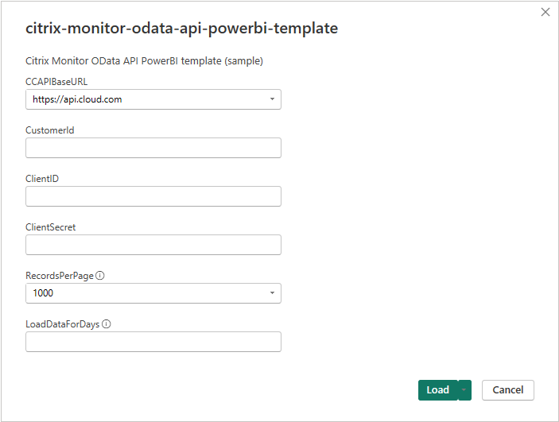
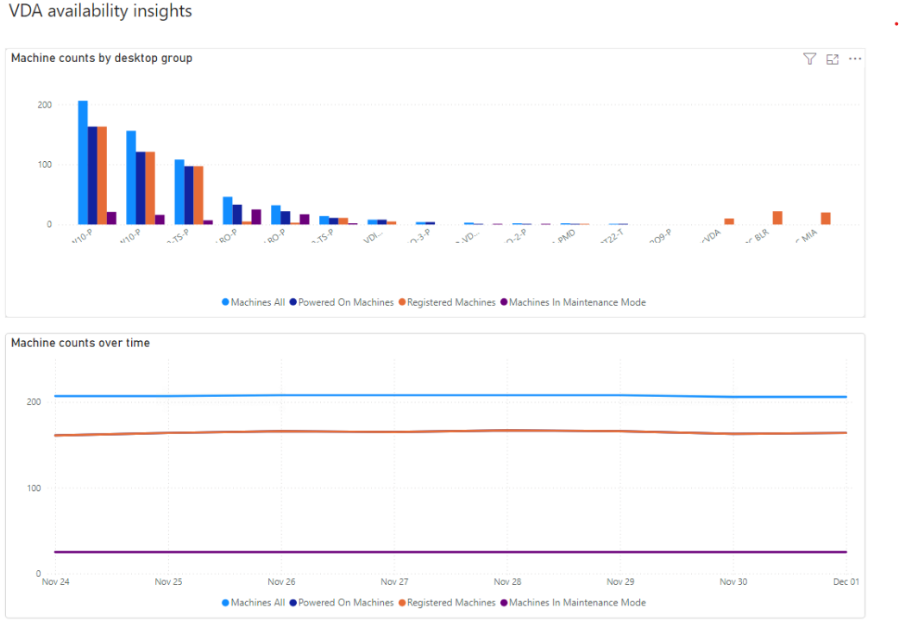
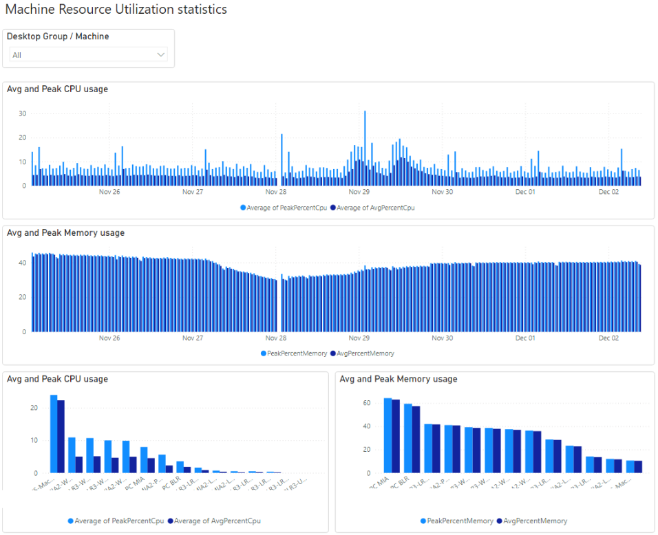
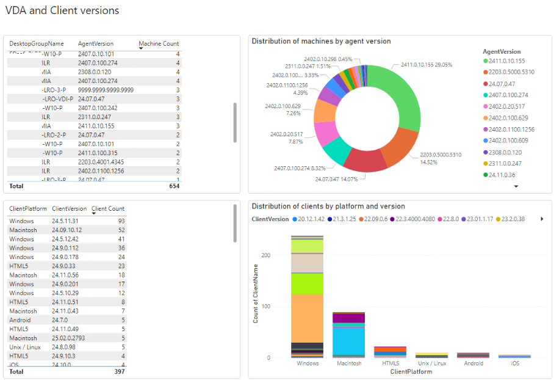

# PowerBI

Citrix Monitor OData API supports integration with PowerBI, for importing data and generating visualizations.
A sample template is provided that can help customers easily get started with PowerBI.

## Importing the template

**Prerequisites**:
Before following the provided steps, make sure you have created an API client in Citrix Cloud.
The [Citrix Cloud API documentation](https://developer-docs.citrix.com/en-us/citrix-cloud/citrix-cloud-api-overview/get-started-with-citrix-cloud-apis) includes the detailed steps.

* Download the .pbit file
* Import the template in PowerBI Desktop
* A popup will appear, with a list of parameters to be populated:

  - **CCAPIBaseURL**: Select the endpoint that applies from the dropdown list. Typically this will be https://api.cloud.com
  - **CustomerId**: Insert the Citrix Customer ID
  - **ClientID**: Insert the Citrix Cloud API client ID
  - **ClientSecret**: Insert the Citrix Cloud API client secret
  - **RecordsPerPage**: Should be 1000
  - **LoadDataForDays**: Enter the number of days in the past you'd like data to be loaded for. You can start with a short time period (e.g. 3 or 7 days) and adjust later on, depending on the imported data volume.
* Click "Load"
* Another popup may appear, prompting for "Privacy level" configuration. The option "*Ignore Privacy Levels*" can be selected.
* The data refresh will follow. 
Note: If the initial/automated data refresh fails, close the refresh window and run a manual refresh by clicking the relevant button at the top level menu. The manual refresh should succeed and the pre-built reports should appear.

## Details on the template structure
The provided template includes a number of parameters (listed above), as well as queries and query functions which abstract operations like the request authentication, the pagination and column transformations.

- The *parameters* can be adjusted as needed, to meet the reporting requirements. For example multiple time range parameters can be defined to support queries requiring less or more historical data.
- The *query functions* GetAccessToken, RunODataQuery, GetDataForPage and GetData include comments about the provided functionality and usage.
- The rest of the *queries* reference the above functions so as to import specific entity data from Citrix Monitor (e.g. Sessions, Users, Connections, Machines, Applications, etc). 
Apart from importing raw data through simple OData requests, filtered and aggregated data can also be loaded in the PowerBI through more complex OData requests. "ResourceUtilizationDGAggregates" is an example that demonstrates how the user can reduce a lot the imported records (e.g. from the ResourceUtilization entity) by defining a query that includes data filtering and aggregations.

## The data model
The template includes a data model with the most commonly used entities of Monitor OData.
The data model does not include all the available OData entities. Users can expand the data model with mode entities, depending on the use cases their reports cover.
The table relationships can either be automatically detected by PowerBI, or manually defined. Typically fields named like "entityId" are foreign keys to the table named Entity and the column named "Id". For example "machineId" is a foreign key to the "Machines" table and the column "Id".
The data model is displayed below.

## Sample reports
The template includes few sample reports that map to actual customer use cases. Customers can use them to extract specific insights and get value out of the underlying data. Customer can also use the sample reports as reference for building new reports for other use cases.

